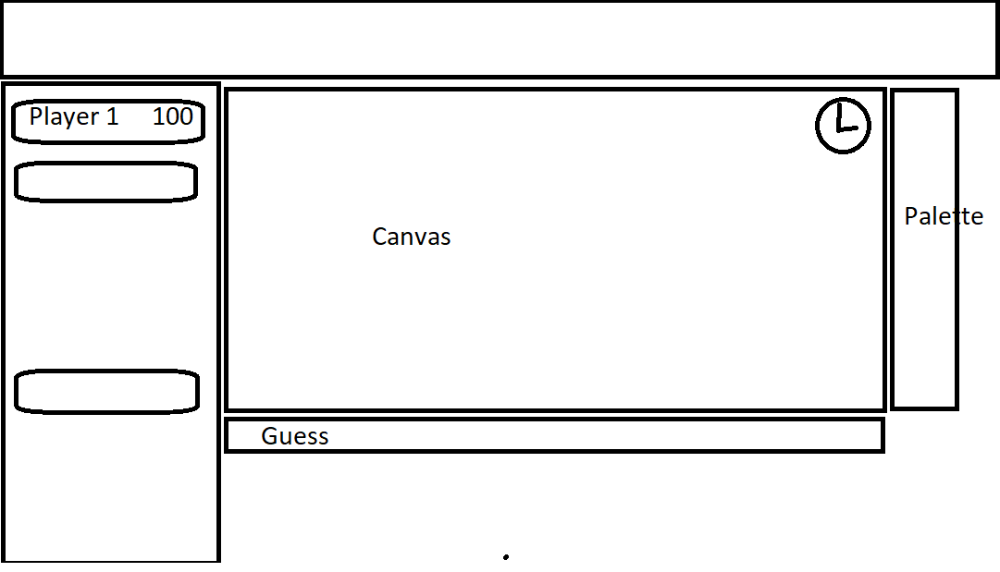

# pictionary

Pictionary platform for handling thousands of users online

## Todo List

### Server

    - Identify unique users
    - Game Loop
      - Pick players in round robin and assign word
      - keep scores in each round till one game is over
      - Show Leaderboard
      - End game if all players have had a chance to draw.
      - Repeat

### Client



This project was bootstrapped with [Create React App](https://github.com/facebook/create-react-app).

## Build project locally

### Server

```
npm  install
DEBUG=pictionary* npm run start
```

### Client

```
npm install
npm run start
```
